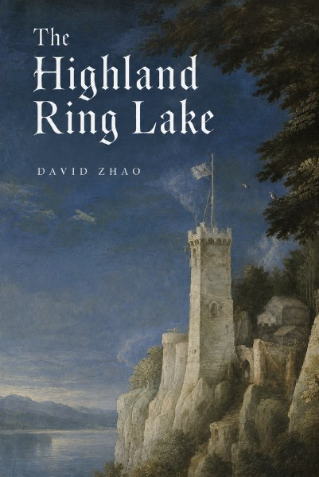

  

  &nbsp;&nbsp;&nbsp;
  &nbsp;&nbsp;&nbsp;
  

## Focus

I work across **data science, analytics engineering, machine learning validation, and risk analytics**, with experience spanning healthcare modeling and large-scale operational systems.

My recent technical work focuses on model evaluation, calibration, temporal validation, local model updating, reproducible analysis, and data-quality controls. Earlier industry work at **Ping An Finserve** focused on structured risk operations, strategy systems, analytics workflows, and product management across nationwide financial portfolios.

**Python · SQL · R · scikit-learn · LightGBM · Model Validation · Calibration · Data Modeling · Risk Analytics · Reproducible Pipelines**

## Selected Work

### Healthcare Risk Model Validation

**External validation · calibration · local model updating · robustness · temporal validation**

Public-safe evidence package and runnable reconstruction of breast cancer risk-model validation work originating from my **BC Cancer / UBC MDS capstone**, with later independent extensions. The retrospective analysis covered up to **438,571 eligible screening exams** across **1–5 year cumulative risk horizons** and included discrimination, calibration, patient-cluster bootstrap, subgroup analysis, first-exam sensitivity analysis, leakage auditing, decision-curve analysis, and future-period temporal validation.

**[Explore the repository →](https://github.com/gugujilulu/healthcare-risk-model-validation)**

### Fraud Policy Decision Science

**Causal diagnosis · randomized policy evaluation · risk economics · adaptive decisions**

An independent simulated case study investigating a fraud loss-rate increase from 0.32% to 0.47%. I follow the evidence from payment routing and a randomized authentication intervention to cross-channel displacement and recovery congestion. The runnable analysis compares policy value, including cases where adaptive rules tie or underperform fixed policies.

**[Explore the case study](https://github.com/gugujilulu/fraud-policy-decision-science) · [Open Policy Lab](https://fraud-policy-lab.gugu4-5.chatgpt.site)**

### Risk Operations & Analytics Systems — Ping An Finserve

**Product management · nationwide debt-collection operations · structured workflows · analytics systems**

As a Product Manager in the Risk Asset Management Center, I worked on **CMP2.0** and **Tianshu**, supporting collection operations across credit-card, consumer-loan, retail-finance, and mortgage portfolios. The work covered spreadsheet-to-system migration, automated operational logging, differentiated workflows across business lines, intelligent dialing strategies, analytics dashboards, strategy middleware, tag and permission models, and execution channels including calls and SMS.

These projects provide the industry and operational context behind my current work in data science: how analytical outputs connect with data structures, workflows, decision logic, and real operating constraints.

## Professional Context

**Healthcare & ML validation** — external validation, calibration, model updating, robustness, temporal validation  
**Risk & operational analytics** — structured workflows, strategy systems, analytics dashboards, financial operations  
**Platform product systems** — earlier work at Qunar and Lilith Games across booking, administration, and internal operational tooling

## Writing

<table>

<tr>
<td width="170" valign="top">

</td>

<td valign="center">
<h3>The Highland Ring Lake</h3>

I’m writing a fantasy novel in Chinese, with an English excerpt shared here.
Two young runaways follow an ancient aqueduct into the mist, through a world of moss sheep, ruined towers and dark humor.

<strong>
<a href="https://github.com/gugujilulu/gugujilulu/blob/ccb83d4e6d4b09ce12beaedcb8541d90d4bf727c/writing/Highland_Ring_Lake_excerpt.pdf">
Read the excerpt · PDF
</a>
</strong>

</td>
</tr>

<tr>
<td width="170" valign="top">

</td>

<td valign="center">
<h3>Sporestar II</h3>

Another ongoing science-fiction novel in Chinese, with an English excerpt shared here. On a conquered ocean world, an investigator enters a dying nuclear submarine with its last surviving guide, following an anomalous sound that reaches across interstellar space.

<strong>
<a href="https://github.com/gugujilulu/gugujilulu/blob/ccb83d4e6d4b09ce12beaedcb8541d90d4bf727c/writing/Sporestar_II.pdf">
Read the excerpt · PDF
</a>
</strong>

</td>
</tr>

</table>

  Data Science · Analytics Engineering · Healthcare Data · Risk Analytics · Reproducible Analytical Systems

