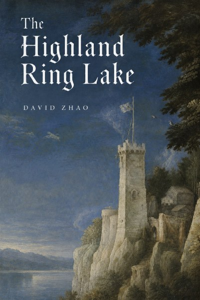

  

  <strong>Data Analyst / Data Scientist · Product, Risk & Business Analytics</strong> 
  UBC Master of Data Science · Vancouver, BC · Authorized to work in Canada

  &nbsp;&nbsp;&nbsp;
  &nbsp;&nbsp;&nbsp;
  

## Focus

I connect **data analysis, machine learning and business decisions**, drawing on a UBC Master of Data Science and two years of product management experience in financial risk operations at **Ping An Finserve**.

My work spans breast cancer risk-model validation, fraud-policy evaluation and nationwide operational systems. I bring experience defining metrics, structuring data, evaluating evidence and translating findings into workflows and decision logic. My background in industrial design and product management also shapes how I build analytical tools: with attention to usability, business context and the people making decisions.

**Python · SQL · R · scikit-learn · LightGBM · Tableau · Power BI · Excel · Git**

## Selected Work

### Healthcare Risk Model Validation

**Machine learning validation · calibration · uncertainty estimation · temporal robustness**

Breast cancer risk-model validation originating from my **BC Cancer / UBC MDS capstone**, with subsequent independent extensions. The retrospective analysis covered up to **438,571 eligible screening exams** across **1–5 year cumulative risk horizons**.

I built reproducible Python workflows for cohort construction, discrimination and calibration analysis, patient-cluster bootstrap, subgroup evaluation and leakage auditing. Later extensions examined local model updating and its performance on future-period data. The repository provides a public-safe evidence package and runnable reconstruction.

**[Explore the repository →](https://github.com/gugujilulu/healthcare-risk-model-validation)**

### Fraud Policy Decision Science

**SQL analytics · randomized intervention evaluation · risk economics · decision support**

An independent simulated case study investigating a fraud loss-rate increase from **0.32% to 0.47%**. I combined SQL cohort analysis, Python simulation and intent-to-treat evaluation to trace the increase and assess authentication-policy trade-offs.

The interactive **Policy Lab** compares **135 scenarios**, connecting fraud losses and transaction completion with recovery capacity, evidence delays and cross-channel displacement.

**[Explore the case study](https://github.com/gugujilulu/fraud-policy-decision-science) · [Open Policy Lab](https://fraud-policy-lab.gugu4-5.chatgpt.site)**

### Central Asian Square-Hole Coinage Atlas

**Data modeling · geographic visualization · product development · digital heritage**

An independent digital heritage platform that I designed and developed, connecting **56 editorial coin families and 1,010 source records** through a multilingual map and catalogue in **English, Chinese and Russian**.

The atlas brings together photographs, historical geography and traceable sources, making specialist material accessible for public education and comparative research. The project also connects with my involvement in the **Vancouver coin club**, where I have been invited to speak on Sogdian numismatics.

**[Explore the repository](https://github.com/gugujilulu/Sogdian-coins-website) · [Open the live atlas](https://sogdian-cash-atlas.gugu4-5.chatgpt.site)**

### Risk Operations & Analytics Systems — Ping An Finserve

**Product management · KPI dashboards · workflow automation · nationwide financial operations**

As a Product Manager in the Risk Asset Management Center, I led the cross-business rollout of **CMP2.0** and designed strategy workflows in **Tianshu**, supporting nationwide collection operations across credit-card, consumer-loan, retail-finance and mortgage portfolios.

The work combined spreadsheet-to-system migration, operational dashboards, automated reporting and multi-channel strategy execution. Digitized workflows saved approximately **two hours per collector per day** and reduced customer complaints by **50%**.

This experience grounds my analytical work in practical questions: which metrics matter, how decisions reach operational teams and how systems support consistent execution.

## Writing

<table>
<tr>
<td width="170" valign="top">

</td>
<td valign="center">
<h3>The Highland Ring Lake</h3>

An ongoing fantasy novel in Chinese, with an English excerpt shared here. Two young runaways follow an ancient aqueduct into the mist, through a world of moss sheep, ruined towers and dark humor.

<strong><a href="https://gugujilulu.github.io/gugujilulu/writing/Highland_Ring_Lake_excerpt.pdf">Read the excerpt · PDF</a></strong>

</td>
</tr>
<tr>
<td width="170" valign="top">

</td>
<td valign="center">
<h3>Sporestar II</h3>

An ongoing science-fiction novel in Chinese, with an English excerpt shared here. On a conquered ocean world, an investigator enters a dying nuclear submarine with its last surviving guide, following an anomalous sound that reaches across interstellar space.

<strong><a href="https://gugujilulu.github.io/gugujilulu/writing/Sporestar_II.pdf">Read the excerpt · PDF</a></strong>

</td>
</tr>
</table>

---

  Open to opportunities in data analytics, data science, risk and business analytics. 
  <a href="mailto:zhaoyifu88@outlook.com">Email</a> · <a href="https://www.linkedin.com/in/yifu-zhao-62b0a0368/">LinkedIn</a>

