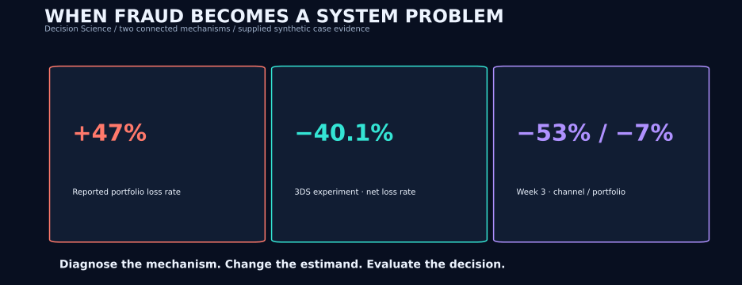
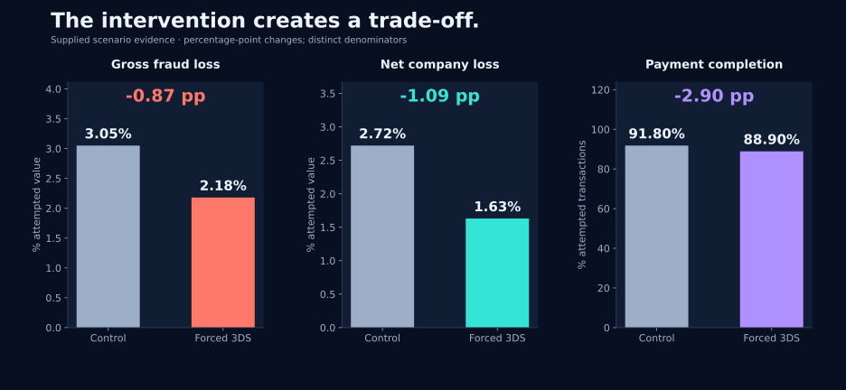
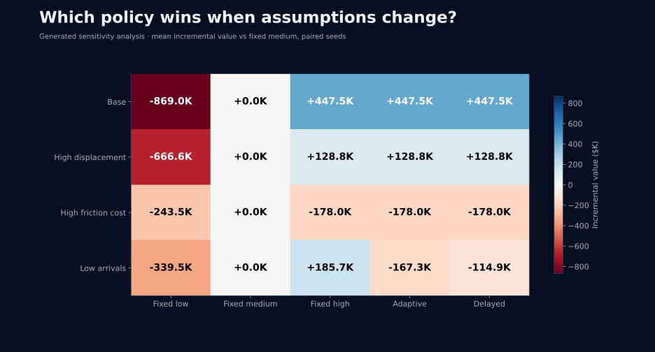

# Fraud Policy Decision Science

**What should change when fraud losses rise by almost 50%?**

The reported loss rate rose from **0.32% to 0.47%** in six weeks. Following the losses led to two connected problems: weak authentication on a payment route and a recovery operation struggling with its caseload. The decision became how to target authentication while accounting for lost sales, fraud moving between channels, and recovery capacity.

**[Open Policy Lab](https://fraud-policy-lab.cosmic-olm-7863.chatgpt.site) · [Read the investigation](docs/research_narrative.md) · [Computed results](docs/results.md)**



*Independent case study by Yifu Zhao (David), developed through a simulated research interview. The headline figures are supplied scenario evidence; the Python analyses generate separate datasets and results. [Evidence provenance](docs/evidence_provenance.md).*

## Three decisions that changed the investigation

**Target the route.** Merchant A's elevated loss rate persisted after matching; Merchant B's largely followed its transaction mix. Within A, unused authentication on a changed payment-service-provider route narrowed the intervention to eligible traffic.

**Count every assigned attempt.** Forced 3-D Secure (3DS) reduced net loss per attempted value from **2.72% to 1.63%**, with a **2.9 percentage-point decline in completion** in the supplied experiment. The strongest benefit occurred among attempts with missing device information. The comparison includes abandoned and declined attempts because authentication changes who completes.

**Follow the money beyond authorization.** By week three, treated-channel loss was down **53%**, while combined loss was down **7%**. Recovery delays created a second reason to evaluate prevention across the system: fewer incoming cases can leave capacity for other recoveries. Policy value depends on the full loss ledger and the time horizon.



## What the runnable analysis adds

The reconstruction tests the implications of the case with explicit data-generating mechanisms. Some results place useful limits on the proposed interventions:

- A same-information challenger fails to improve ranking in the generated low-observability population. Adding an authorization-time signal changes the available information.
- Under the default queue conditions, both adaptive rules stay at 80% authentication and **tie fixed 80%**. With lower arrivals, their release thresholds reduce value relative to fixed 50%.
- Capacity and automation have an equal-dose interaction of **−$253.6K** over 12 paired seeds: some of their economic benefits overlap.



The [Policy Lab](https://fraud-policy-lab.cosmic-olm-7863.chatgpt.site) compares five rules across capacity, evidence delay and displacement assumptions. Its 135 precomputed scenarios use one paired seed; [multi-seed comparisons and intervals](docs/results.md) provide the separate uncertainty analysis.

## Follow the analysis

| Question | Analysis and implementation |
|---|---|
| Did risk rise, or did losses enter the dashboard later? | [Three clocks and mature cohorts](docs/research_narrative.md#1-establish-the-population-before-explaining-the-increase); [SQL](sql/) |
| Why target Merchant A? | [Merchant comparison and routing](docs/research_narrative.md#3-keep-the-counterexample-merchant-b); [standardization](src/fraud_case/cohorts.py) |
| What did randomized authentication change? | [ITT, completion selection and heterogeneity](docs/experiment.md); [estimators](src/fraud_case/estimators.py) |
| Would another model help? | [Information and temporal diagnostics](docs/model_diagnostics.md); [model comparisons](src/fraud_case/models.py) |
| How do displacement and recovery affect value? | [Queue economics and dynamic evaluation](docs/adaptive_evaluation.md); [operating simulator](src/fraud_case/operations.py) |

[All figures and outputs](docs/artifact_inventory.md) · [Data definitions](docs/data_contracts.md) · [Validation](docs/validation.md)

## Reproduce

Python **3.12** is the tested environment. From this project directory:

```bash
python -m venv .venv
source .venv/bin/activate
python -m pip install -r requirements-lock.txt
python -m pip install --no-build-isolation --no-deps -e .
python -m unittest discover -s tests -v
OPENBLAS_NUM_THREADS=1 OMP_NUM_THREADS=1 python run_all.py
python check_artifacts.py
```

On Windows, activate with `.venv\Scripts\activate` and run `python run_all.py` after activation. In the profile repository, first enter `projects/fraud-policy-decision-science`.

The lock file pins the analysis environment, including transitive dependencies and build tooling. `pyproject.toml` defines package metadata; `requirements.txt` defines supported dependency ranges. For development, install `requirements-dev-lock.txt` and run `ruff check .` and `ruff format --check .`.

`run_all.py` rebuilds the SQL outputs, estimates, model diagnostics, policy scenarios, figures, results note and self-contained explorer. [Configuration](configs/base.json) controls sample sizes, seeds and operating assumptions. [Five notebooks](notebooks/) provide module walkthroughs using the installed package. The generated HTML in `reports/` also opens locally without a server.

## Data and scope

`data/case_inputs/` contains supplied aggregate evidence. `src/fraud_case/` holds the analysis; `results/tables/` and `results/figures/` hold computed outputs. Generated microdata are created locally and excluded from version control.

The queue parameters specify a mechanism study. Applying its economic comparisons to an operating portfolio would require observed costs, mature transaction outcomes and calibrated arrival, recovery and displacement processes. The sequential estimator is validated in a separate short-horizon randomized state model. [The evaluation note](docs/adaptive_evaluation.md) defines both studies and their estimands.
