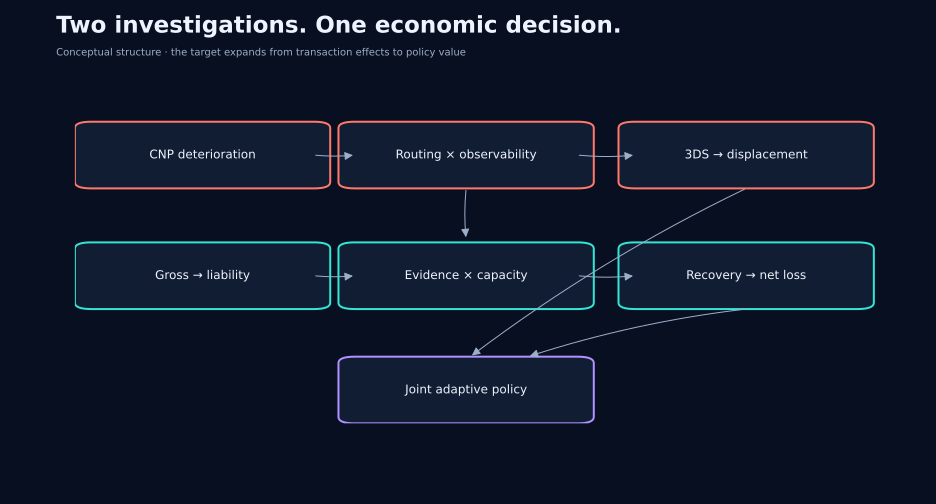
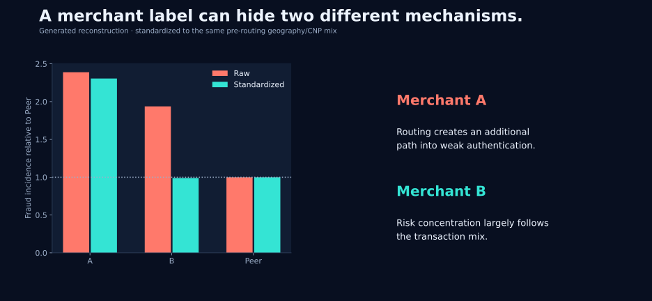
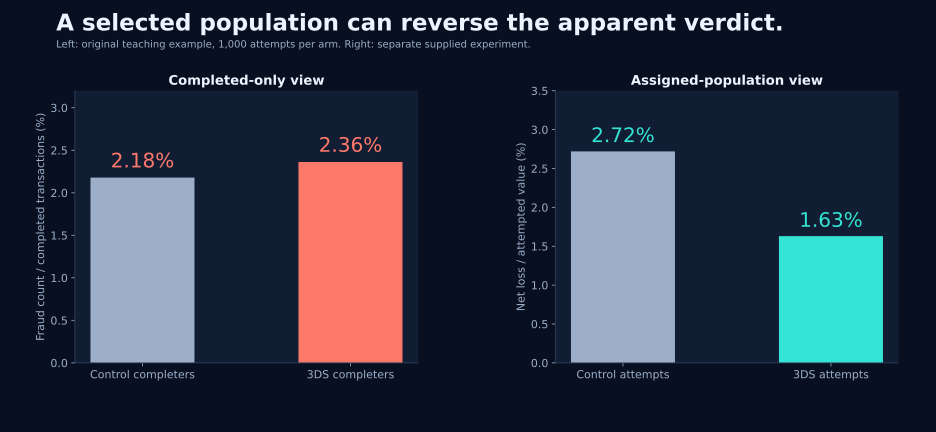
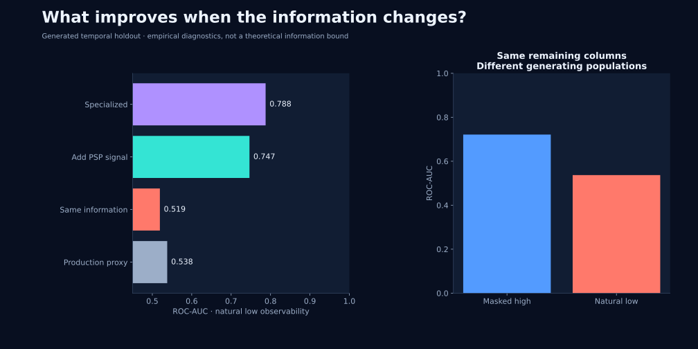
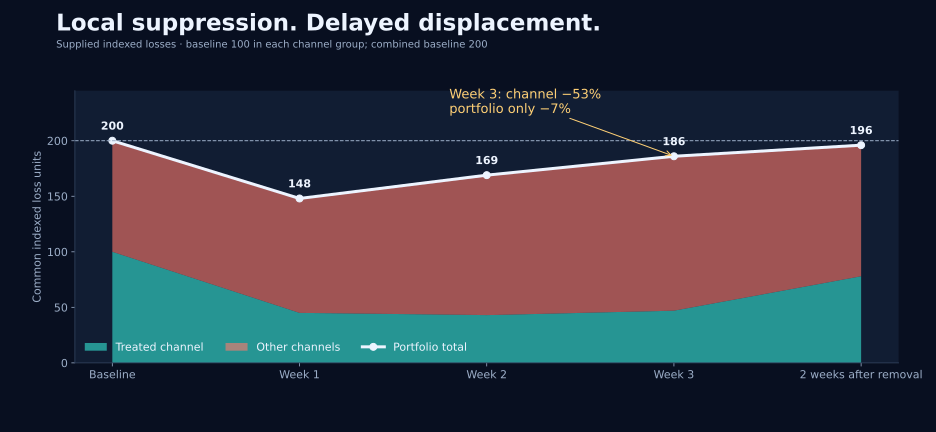
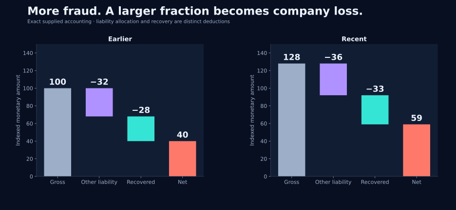
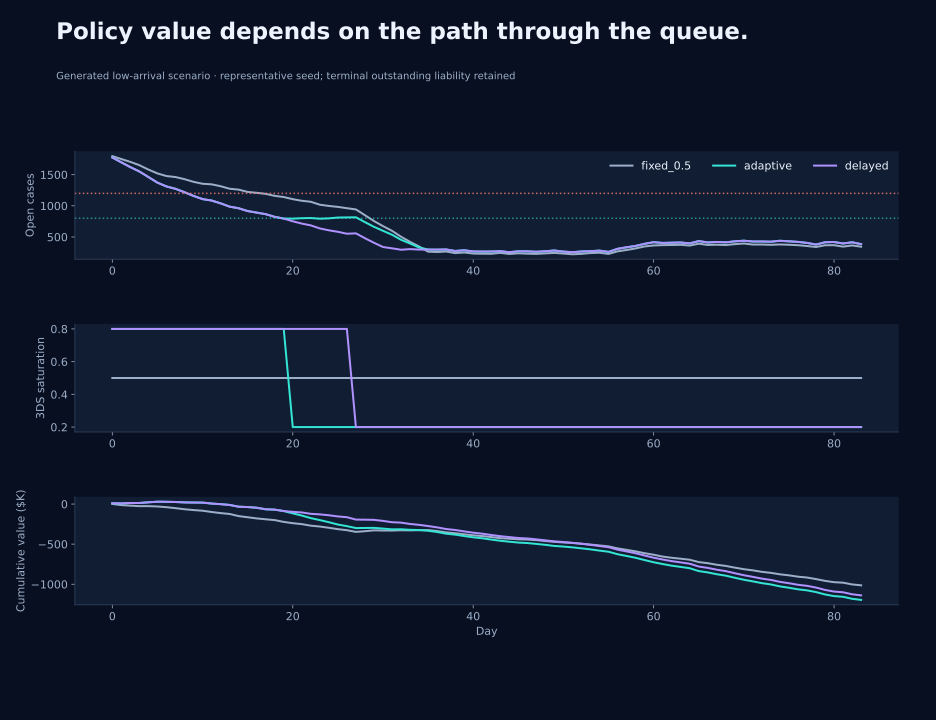

# Fraud Policy Decision Science

**From a rising loss rate to a policy that accounts for information, adaptation and operational capacity.**


A Decision Scientist case study by **Yifu Zhao (David)**. The investigation follows a payment-risk problem through two connected pathways: how fraud gets through authorization, and how gross fraud becomes the company's final loss. The research begins with a metric increase and ends with the evaluation of a state-dependent decision rule.

**Explore:** [Research narrative](docs/research_narrative.md) · [Results & uncertainty](docs/results.md) · [Interactive policy lab](reports/policy_explorer.html) · [Reproduce](#run-the-project) · [Evidence map](docs/source_notes.md)

The case evidence was supplied during a simulated research interview. The executable analyses use separately generated data with explicit mechanisms and seeds. Every figure identifies its evidence population. The interactive HTML runs offline after download; GitHub displays its source.

## The decision in one minute

The reported portfolio fraud loss rate rose from **0.32% to 0.47%**. Mature CNP cohorts also deteriorated, directing the investigation toward transaction behavior and payment routing. Merchant A retained an elevated loss rate after matching; Merchant B's apparent anomaly largely followed its transaction mix.

A randomized forced-3DS intervention in Merchant A's eligible flow reduced supplied net loss per attempted value from **2.72% to 1.63%**, alongside a **2.9 percentage-point completion decline**. The largest benefit occurred where authorization-time information was weakest. Subsequent channel evidence changed the decision: by week three, treated-channel indexed loss was down **53%**, while combined loss was down **7%**.

The second pathway explains why prevention's value extends into operations. Liability allocation and recovery performance lifted net loss from **40 to 59** indexed units. Evidence delays and limited processing capacity created congestion, allowing prevention to improve recovery outcomes on other cases sharing the queue.

**Decision:** assess targeted authentication together with recovery capacity, evidence automation and policy history. Evaluate portfolio economic value over a stated horizon, including conversion cost and unresolved liability. The executable reconstruction shows when adaptive rules change actions—and when they behave exactly like a fixed rule.



## What the investigation establishes

| Research turn | Evidence and analytical move | Consequence for the decision |
|---|---|---|
| Is the increase real? | Separate transaction, report and recognition clocks; compare mature CNP cohorts | Use a common exposure population and follow-up window |
| Why Merchant A? | Compare raw and matched risk; retain Merchant B as a composition counterexample | Investigate route × authentication × observability |
| Does forced 3DS help? | Randomized assignment; ITT across all eligible attempts | Price loss reduction against completion and authentication costs |
| Would a better model solve it? | Same-information challengers, masking, new PSP signals, temporal holdout | Distinguish representation quality, missing information and population change |
| Where does the fraud go? | Trace treated and other channels; randomize saturation schedules | Measure portfolio loss with carryover and exposure history |
| Why does net loss rise faster? | Gross → liability → realized recovery; explicit interaction and Shapley decompositions | Connect case composition to operating performance |
| Which rule should run? | Case-level queue simulation, equal-dose factorial, paired policy scenarios, sequential IPW validation | Compare complete dynamic policies with costs and uncertainty |

## Selected findings

### Merchant A and Merchant B lead to different actions

The supplied case gives Merchant A a raw relative loss rate of approximately **2.8×**, narrowing to **1.6×** in a matched population. Merchant B's excess largely disappears after adjustment. The executable reconstruction below uses direct standardization of pre-routing geography/CNP mix and measures **fraud incidence**, producing its own numerical results.



### An experiment changes both loss and who completes


The primary estimand is the assignment effect on net loss per attempted value. Conditioning on successful authentication or payment completion selects a population affected by treatment. The [experiment note](docs/experiment.md) derives the estimator, explains heterogeneity and keeps the original small teaching example separate from the larger case experiment.



### Information and model quality need separate experiments

The generated temporal holdout compares a production proxy, a challenger with identical information, additional PSP information and a specialized low-observability model. ROC-AUC, average precision, Brier score and log loss are reported together. Masking a rich population supplies a different diagnostic from testing naturally weakly observed traffic.



[Model design and interpretation](docs/model_diagnostics.md)

### A local win can fade at portfolio level



The supplied time series motivates interference-aware experimentation. A separate runnable six-channel simulation records randomized saturation, incoming/outgoing displacement and prior exposure. Its blocked assignment has marginal probability 1/3 at each saturation; joint assignments are constrained within each block.

### Operations change the economics of prevention



The queue engine models arrival-level liability, evidence readiness, processing effort, filing deadlines, recovery and terminal outstanding cases. Every case and cash flow reconciles. A matched **2×2 factorial** evaluates +450 weekly service units and 70% automation at the same doses in the combined cell. An unlimited-capacity ablation isolates the contribution of congestion.




The default adaptive and delayed rules remain at high intensity and tie fixed 80% over the horizon. Lower arrivals and changes in evidence readiness create different paths. [Numerical results](docs/results.md) include paired confidence intervals and Monte Carlo calibration; [policy evaluation](docs/adaptive_evaluation.md) separates simulation value, action effects and full-policy identification.

## Run the project

Python **3.12** is the tested environment. From the repository root:

```bash
cd projects/fraud-policy-decision-science
python -m venv .venv
source .venv/bin/activate
python -m pip install -r requirements-lock.txt
python -m unittest discover -s tests -v
OPENBLAS_NUM_THREADS=1 OMP_NUM_THREADS=1 python run_all.py
```

On Windows, activate with `.venv\Scripts\activate`; run `python run_all.py` after activation. For a standalone copy, start inside this project directory. `requirements.txt` records supported dependency ranges; the lock file records the locally tested direct versions.

One entry point regenerates SQL outputs, experiment estimates, model diagnostics, operational scenarios, sequential-estimator validation, SVG/PNG charts, and the offline explorer. Configuration lives in [configs/base.json](configs/base.json). Notebook views are thin, executable entry points into the same modules.

```bash
python run_all.py --config configs/base.json
python -m http.server 8000
```

Then open `http://localhost:8000/reports/policy_explorer.html`, or open the downloaded HTML directly. All 135 explorer settings are precomputed by the same queue engine. The explorer uses one seed; policy comparisons use 12 paired seeds.

## Repository map

| Location | Contents |
|---|---|
| `src/fraud_case/` | Data generators, estimators, SQL adapter, model diagnostics, queue engine, saturation experiment, sequential validation, charts and explorer builder |
| `sql/` | Recognition-clock dashboard and mature transaction-cohort queries |
| `configs/` | Seeds, sample sizes, costs, service capacity and controller thresholds |
| `data/case_inputs/` | Supplied aggregate scenario evidence, source labels and units |
| `data/generated/` | Regenerated transaction/case data, excluded from version control |
| `notebooks/` | Five module walkthroughs using the production analysis functions |
| `results/tables/` | Reproducible estimates, calibration checks, policy comparisons and trajectories |
| `results/figures/` | High-contrast SVG figures; PNG exports produced by the pipeline |
| `reports/` | Self-contained interactive policy explorer |
| `docs/` | Research narrative, estimands, evidence reconciliation, data contracts and results |
| `tests/` | Accounting, assignment, maturity, hysteresis, reproducibility and mechanism tests |

See the [complete artifact inventory](docs/artifact_inventory.md) and [implementation checklist](docs/upgrade_checklist.md).

## Scope of the reconstruction

The supplied aggregates motivate the research. Generated datasets demonstrate the analytical methods and carry their own values. The queue model encodes a plausible mechanism rather than a fitted operational forecast; costs, delays and response functions are configurable. The sequential estimator is validated in a separate short-horizon randomized state model, with its own estimand and known data-generating process. Moving from this portfolio project to a live policy requires transaction-level outcome maturation, actual cost estimates, and an experimental design with support for the candidate policy histories.
