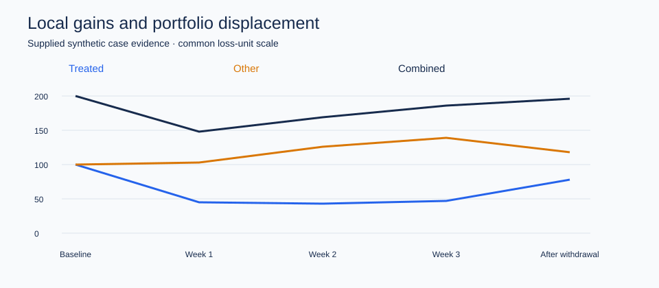

# Fraud Policy Decision Science

**From rising CNP losses to targeted authentication and adaptive policy evaluation.**

An independent Decision Scientist case study examining how to diagnose a fraud-loss increase, design a randomized intervention, and evaluate policy value when attackers and recovery operations respond to the intervention.

The study was developed through an iterative simulated research interview. All numerical results are supplied synthetic scenario evidence. The contribution is the analytical reasoning, experimental design, and decision framework; the current release is a documented case study. Executable reconstruction is a planned extension.

## The decision

Over six weeks, reported fraud loss rate increased from **0.32% to 0.47%**, while transaction volume was roughly flat and overall approval rate remained stable.

> “Fraud losses are up almost 50%. Should we tighten our fraud policy?”

My analysis develops a targeted response: strengthen authentication for low-observability, otherwise-exempted traffic; improve recovery capacity and evidence workflows; and evaluate the resulting policy over a horizon that captures displacement and queue dynamics.

## 1. Establish what changed

I began with the metric definition and its clock: transaction date, fraud reporting date, and loss recognition date. Comparing transaction cohorts at a common follow-up horizon separates underlying deterioration from delayed recognition.

The supplied case evidence then localized the change:

| Finding | Earlier | Later | Interpretation |
|---|---:|---:|---|
| Reported portfolio loss rate | 0.32% | 0.47% | +0.15 percentage points; approximately +47% relative |
| CNP share of fraud losses | 41% | 68% | Loss concentration shifted toward card-not-present payments |
| Mature-cohort CNP fraud loss rate | 0.44% | 0.78% | Deterioration persisted after aligning maturity |
| CNP fraudulent transaction count | Baseline | +49% | Frequency contributed materially |
| Average CNP fraud loss | Baseline | +12% | Severity also increased |

Digital goods, electronics, and travel accounted for **57% of incremental losses**, and two merchants accounted for **21%**. These overlapping views guided the investigation; they represent different partitions of the same loss pool.

The core decomposition is:

**Fraud loss rate = fraudulent transaction count × average fraud loss / transaction value.**

Portfolio rate changes also depend on segment weights. Frequency, severity, and mix are reconciled within a common cohort and accounting definition.

## 2. Diagnose Merchant A's decision pathway

Merchant A's server-to-server checkout flow represented **22% of its transactions and 61% of its incremental losses**. The investigation connected integration architecture, device observability, PSP routing, and authentication exemptions.

| Merchant A S2S flow | Before routing change | After routing change |
|---|---:|---:|
| 3DS exemption routing rate | 19% | 44% |
| Missing device fingerprint | 33% | 35% |
| Mature-cohort loss rate | 1.9% | 4.6% |

The strongest operational hypothesis was a composition shift into the already-risky **missing-device × exempted** state. Comparable merchants on the same PSP moved in the same direction; other-PSP comparisons and Merchant A's alternative route provided additional checks.

This supports a targeted intervention hypothesis. Precise causal attribution to the routing change remains limited by changing exemption selection and unavailable PSP risk information. Authentication is also a potential mediator, so adjustment choices depend on the causal question.

## 3. Evaluate assignment to forced 3DS

The case proposed a four-week experiment covering approximately **80,000 eligible transactions**, with up to **20% assigned to forced 3DS** among transactions that would otherwise receive an exemption.

Randomization was stratified by pre-treatment PSP risk tier, exemption type, routing reason, channel, and device availability. Fraud outcomes were evaluated after cohort maturity; payment completion was monitored immediately.

The primary estimand is the **intention-to-treat effect of assignment to the policy**. Noncompliance remains part of the policy's operational effect.

| Supplied scenario outcome | Control | Assigned forced 3DS | Absolute difference |
|---|---:|---:|---:|
| Payment completion | 91.8% | 88.9% | −2.90 pp |
| Gross fraud loss / attempted value | 3.05% | 2.18% | −0.87 pp |
| Net company loss / attempted value | 2.72% | 1.63% | −1.09 pp |

The net-loss-rate reduction is approximately **40.1% relative**, accompanied by a payment-completion trade-off. Deployment value incorporates legitimate contribution margin, authentication fees, and operating costs.

Completed-only comparisons condition on an outcome affected by treatment. I retained the assigned population for the primary analysis and separated transaction-count rates from value-based loss rates.

Pre-specified device segments also showed different policy effects:

| Device availability | Gross loss ITT | Net loss ITT | Completion ITT |
|---|---:|---:|---:|
| Present | −0.28 pp | −0.41 pp | −2.3 pp |
| Missing | −2.05 pp | −2.54 pp | −3.4 pp |

These supplied contrasts support prioritizing low-observability traffic for further policy evaluation. The apparent $150–$600 opportunity was treated as exploratory; subsequent case analysis supported a smooth amount relationship rather than a special interval.

## 4. Move the outcome to the portfolio

The case introduced a historical channel intervention with strong local improvement and growing losses elsewhere:

| Period | Treated channel index | Other channels index | Combined loss units |
|---|---:|---:|---:|
| Baseline | 100 | 100 | 200 |
| Week 1 | 45 | 103 | 148 |
| Week 2 | 43 | 126 | 169 |
| Week 3 | 47 | 139 | 186 |
| Two weeks after withdrawal | 78 | 118 | 196 |

By week three, the treated channel was 53% below baseline while combined losses were only 7% lower. This motivated an evaluation design that measures cross-channel displacement, treatment saturation, and multiweek carryover. The table is descriptive scenario evidence.

The analytical unit expands to linked account or credential clusters and system-level exposure periods. The target becomes durable portfolio value under a coverage policy.

## 5. Connect prevention with recovery operations

In the downstream case extension, gross confirmed fraud grew **28%** while net company loss grew **47%**. Liability allocation and recovery performance connect the two:

**Net loss = gross fraud × company liability share × (1 − recovery rate).**

The recovery rate is defined on company-liable dollars. Segment-level accounting preserves differences in liability and recoverability.

Weekly case arrivals increased from **1,000 to 1,690**, while processing increased from **1,020 to 1,280**. Backlog rose from **420 to 1,870**, and pre-processing queue time increased from **0.6 to 2.4 days**. This directed the response toward capacity and slow evidence workflows.

Preventing additional cases can improve recovery on other cases by relieving congestion. Portfolio net loss already incorporates that recovery benefit; mechanism-level savings are reconciled to the total.

## 6. Evaluate the adaptive rule itself

The candidate rule increases authentication coverage above **1,200 pending cases**, and considers relaxation below **800**, with a delayed-release variant that retains stronger authentication for an additional week.

Backlog reflects fraud arrivals, staffing, seasonality, and previous policy actions. The proposed evaluation randomizes the action at eligible decision points within recorded operational states. The state includes backlog, recent arrivals, capacity, risk composition, and policy history.

The objective is:

**V(policy) = expected cumulative legitimate contribution margin − net fraud loss − authentication cost − operating cost.**

The target comparison is **V(adaptive policy) − V(fixed policy)** over a common multiweek horizon. Trigger-level randomized effects are inputs to this evaluation; complete policy value also requires accounting for subsequent state transitions and actions.

The design specifies action probabilities, eligible states, carryover, delayed outcomes, and an independent evaluation period. Sequential weighting or g-computation can support policy-value estimation where action coverage and assumptions permit. The 1,200/800 thresholds are candidate settings for evaluation.

## What this project demonstrates

- Metric construction and cohort maturity before intervention selection.
- Frequency, severity, mix, liability, and recovery decomposition.
- Causal reasoning about routing, selection, observability, and authentication.
- Randomized policy evaluation with ITT, economic trade-offs, and pre-treatment heterogeneity.
- A progression from transaction effects to portfolio effects and dynamic policy value.
- Translating analytical findings into targeted operational decisions.

## Evidence and implementation status

The source is the August 31, 2026 fraud-case research walkthrough, organized into 22 analytical stages. Numerical tables above are curated synthetic case inputs; percentage-point differences and relative changes are arithmetic derived from those inputs.

Transaction-level data, assignment logs, uncertainty estimates, and a fitted dynamic model are future reconstruction requirements. Reported case contrasts therefore carry the status of supplied scenario evidence. The executable extension will document generated data and model assumptions separately.

## My contribution

I developed the analytical questioning and decision logic through the case: clarifying the loss metric, tracing merchant and routing mechanisms, specifying randomized interventions, interrogating selection and heterogeneity, and extending evaluation to displacement, recovery congestion, and adaptive rules. This repository organizes that research process into a portfolio case study.

## Supporting material

- [Adaptive evaluation protocol and candidate state diagram](docs/adaptive_evaluation.md)
- [Source map and numerical reconciliation](docs/source_notes.md)
- [Supplied aggregate inputs](data/case_inputs/)
