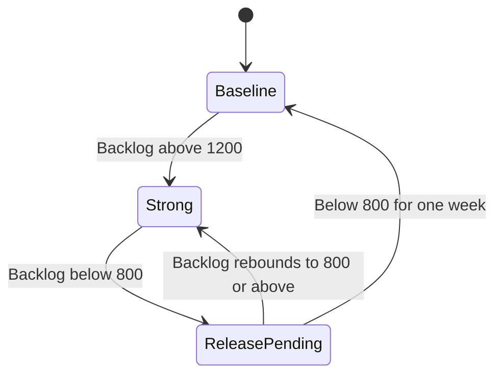

# Adaptive policy evaluation

Evaluate expected cumulative legitimate contribution margin minus net fraud loss, authentication fees and operating costs over a common multiweek horizon.

Record backlog, arrivals, capacity, transaction-risk mix, previous coverage and time since switching before each decision. Randomize escalation versus maintaining baseline at eligible high-backlog decisions; randomize relaxation versus continued coverage at eligible low-backlog decisions. Record action probabilities and label maturity. Shared recovery queues require system-level exposure and evaluation.

Trigger-level contrasts identify local action effects. Full policy values require subsequent state transitions and actions: use sequential weighting or g-computation under supported action probabilities and stated assumptions. Keep threshold selection separate from final evaluation and account for temporal dependence and displacement carryover.

This diagram specifies a candidate delayed-release implementation. Its one-week continuous-low requirement and rebound behavior are explicit design choices for future evaluation. The walkthrough motivates delay but does not estimate these precise settings as optimal.
