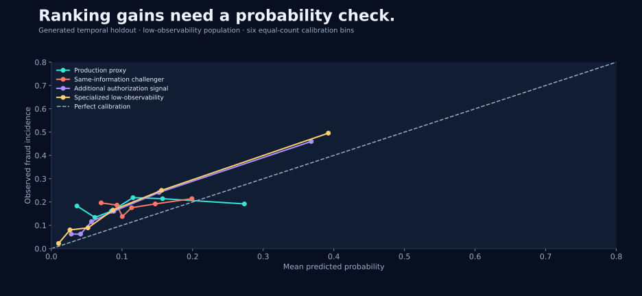
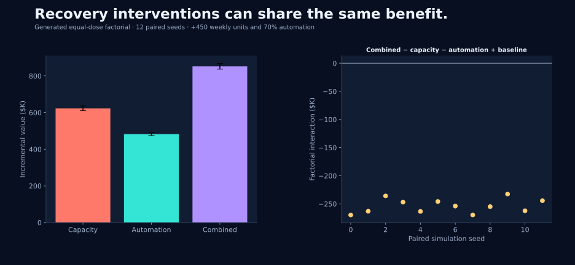

# Computed results and uncertainty

Generated by `run_all.py` from the committed configuration and analysis functions. Supplied case point estimates remain in `data/case_inputs/`; all results below belong to the executable reconstruction.

## Randomized intervention

| Outcome | Control (%) | Treatment (%) | ITT (pp) | 95% CI (pp) |
| --- | --- | --- | --- | --- |
| net | 4.859 | 2.288 | -2.570 | [-2.891, -2.250] |
| gross | 5.459 | 3.092 | -2.367 | [-2.774, -1.960] |
| completion | 92.339 | 89.431 | -2.909 | [-3.427, -2.390] |

Loss rates use attempted value; completion uses attempted transaction count. These generated magnitudes differ from the supplied experiment by design. Across 160 fresh stratified assignments, net-ratio ITT bias is **+0.0295 percentage points**, empirical 95% interval coverage is **97.5%**, and the Monte Carlo standard error of that coverage is **1.23%**. The finite-population truth is computed from both potential outcomes; estimation uses only observed outcomes. See `heterogeneity.csv` for the missing-minus-present treatment-effect contrast.

## Merchant comparison

| merchant | raw_relative | standardized_relative |
| --- | --- | --- |
| A | 2.389 | 2.306 |
| B | 1.937 | 0.989 |
| Peer | 1.000 | 1.000 |

The generated measure is fraud incidence standardized to a common pre-routing geography/CNP mix. Merchant B's excess largely follows composition. Merchant A retains the route-linked mechanism. The source case uses richer matching and loss-rate outcomes, so its 2.8×/1.6× values belong to a separate analysis.

## Temporal information diagnostics

| model | population | roc_auc | pr_auc | brier |
| --- | --- | --- | --- | --- |
| Production proxy | High | 0.873 | 0.549 | 0.075 |
| Production proxy | Low | 0.538 | 0.204 | 0.159 |
| Same-information challenger | High | 0.869 | 0.548 | 0.075 |
| Same-information challenger | Low | 0.519 | 0.202 | 0.155 |
| Additional authorization signal | High | 0.867 | 0.543 | 0.075 |
| Additional authorization signal | Low | 0.747 | 0.454 | 0.132 |
| Specialized low-observability | Low | 0.788 | 0.503 | 0.126 |
| Remaining-information diagnostic | Masked high | 0.721 | 0.259 | 0.098 |
| Remaining-information diagnostic | Natural low | 0.537 | 0.204 | 0.154 |

`pr_auc` is average precision. The specialized model has the additional PSP feature and trains on the early weak-observability subset. Masked-high and natural-low diagnostics fit separately on the same remaining columns. Point estimates are descriptive; the calibration plot and `calibration.csv` expose probability performance.

## Policy value across assumptions

| Scenario | Policy | Value vs fixed 50% ($K) | 95% paired CI ($K) |
| --- | --- | --- | --- |
| Base | adaptive | +447.5 | [+440.2, +454.7] |
| Base | delayed | +447.5 | [+440.2, +454.7] |
| Base | fixed_0.2 | -869.0 | [-883.6, -854.3] |
| Base | fixed_0.5 | +0.0 | [+0.0, +0.0] |
| Base | fixed_0.8 | +447.5 | [+440.2, +454.7] |
| High displacement | adaptive | +128.8 | [+120.4, +137.3] |
| High displacement | delayed | +128.8 | [+120.4, +137.3] |
| High displacement | fixed_0.2 | -666.6 | [-678.3, -655.0] |
| High displacement | fixed_0.5 | +0.0 | [+0.0, +0.0] |
| High displacement | fixed_0.8 | +128.8 | [+120.4, +137.3] |
| High friction cost | adaptive | -178.0 | [-185.3, -170.7] |
| High friction cost | delayed | -178.0 | [-185.3, -170.7] |
| High friction cost | fixed_0.2 | -243.5 | [-258.2, -228.8] |
| High friction cost | fixed_0.5 | +0.0 | [+0.0, +0.0] |
| High friction cost | fixed_0.8 | -178.0 | [-185.3, -170.7] |
| Low arrivals | adaptive | -167.3 | [-177.2, -157.4] |
| Low arrivals | delayed | -114.9 | [-125.2, -104.6] |
| Low arrivals | fixed_0.2 | -339.5 | [-346.8, -332.3] |
| Low arrivals | fixed_0.5 | +0.0 | [+0.0, +0.0] |
| Low arrivals | fixed_0.8 | +185.7 | [+182.4, +189.0] |

Each comparison uses 12 paired seeds over 84 days. Intervals represent Monte Carlo uncertainty conditional on a specified generator. The high-friction stress scenario raises legitimate contribution margin from $0.65 to $65 per completed attempt, deliberately testing a high-value transaction setting. Low arrivals use 1,100 cases/week; high displacement uses strength 0.95. These scenario changes are explicit assumptions, not estimates from the case.

Default adaptive and delayed rules remain at 80% throughout and match fixed high intensity. At lower arrivals, the controller releases authentication and sacrifices loss-prevention value under the specified thresholds. High friction can change which fixed intensity is economically attractive. These results make threshold selection and cost calibration part of the decision.

## Operational interaction

The equal-dose factorial interaction averages **$-253.6K**, with a paired-seed 95% interval of **[$-261.6K, $-245.6K]**. Its sign is retained from the simulation. The combined intervention's gain over either component and superadditivity are different comparisons.

`uncongested_ablation.csv` removes the service-capacity constraint while retaining evidence delays, deadlines and recovery quality. Under that ablation, adding capacity changes cost alone, verified in the test suite.

## Sequential-policy estimator validation

| Policy | Bias | Coverage | Mean effective trajectories |
| --- | --- | --- | --- |
| adaptive | +0.127 | 93.3% | 140.2 |
| fixed_high | -0.017 | 93.3% | 137.3 |
| fixed_low | -0.019 | 93.3% | 138.1 |

For each rule, 60 independently randomized datasets contain 2,200 four-step trajectories. Compatible histories receive weight 16; the average effective sample is therefore much smaller than the number of episodes. A separate 100,000-trajectory on-policy simulation approximates the true expectation. Coverage's Monte Carlo standard error is roughly three percentage points at the reported values; 60 repetitions give a diagnostic rather than a precise calibration certificate. The adaptive estimate's finite Monte Carlo bias is reported directly.

The operational simulator and this sequential validation use different data-generating processes. Forward queue-policy comparisons validate operational consequences under assumptions; the sequential demonstration checks identification and weighting under randomized history support.

## Reproducibility record

Python 3.12.13; direct package versions are in `results/summary.json` and `requirements-lock.txt`. All point estimates, scenario comparisons, validation replicates, case inputs and source fingerprints are committed or reproducible from the entry point. Supplied-aggregate experimental uncertainty remains unavailable from the original materials.
